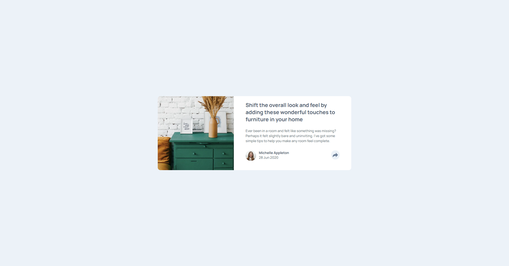

This is a solution to the [Article preview component challenge on Frontend Mentor](https://www.frontendmentor.io/challenges/article-preview-component-dYBN_pYFT). Frontend Mentor challenges help you improve your coding skills by building realistic projects. 

## Table of contents

- [Overview](#overview)
  - [The challenge](#the-challenge)
  - [Screenshot](#screenshot)
  - [Links](#links)
- [My process](#my-process)
  - [Built with](#built-with)
  - [What I learned](#what-i-learned)
  - [Continued development](#continued-development)
  - [Useful resources](#useful-resources)
- [Author](#author)
- [Acknowledgments](#acknowledgments)


## Overview

### The challenge

Users should be able to:

- View the optimal layout for the component depending on their device's screen size
- See the social media share links when they click the share icon

### Screenshot



### Links

- Solution URL: [Add solution URL here](https://www.frontendmentor.io/solutions/article-card-component-made-with-html-sass-and-js-Zxy1M8Hn_)
- Live Site URL: [Add live site URL here](https://frankiiize.github.io/articlePreview-FrontMentor/)

## My process

### Built with

- Semantic HTML5 markup
- CSS custom properties
- Flexbox
- CSS Grid
- Mobile-first workflow

### What I learned

I got experience how to create a component, hide elements using javascrip and css, for alignment use css grid and flexbox


```js

const showTooltip =  () =>  {
    let tooltip = document.querySelector('#tooltip');
    if (tooltip.className == "d-none") {
        tooltip.className = "cardContainer__share__tooltip";
        setTimeout(() => tooltip.classList.toggle('change'), 100);
        } else {
            tooltip.classList.toggle('changeOff');
            setTimeout( function(){
                tooltip.className ="d-none";
            },400);  
        }
    }


const hideTooltip = () => {
    let tooltip = document.querySelector('#tooltip');
    
    tooltip.classList.toggle('changeOff');
    setTimeout( function(){
        tooltip.className ="d-none";
    },400);   
}
```
## Author

- Website - [My githup profile](https://github.com/Frankiiize)
- Frontend Mentor - [@Frankiiize](https://www.frontendmentor.io/profile/Frankiiize)
- Twitter - [@Frankiiize](https://www.twitter.com/frankiiize)
